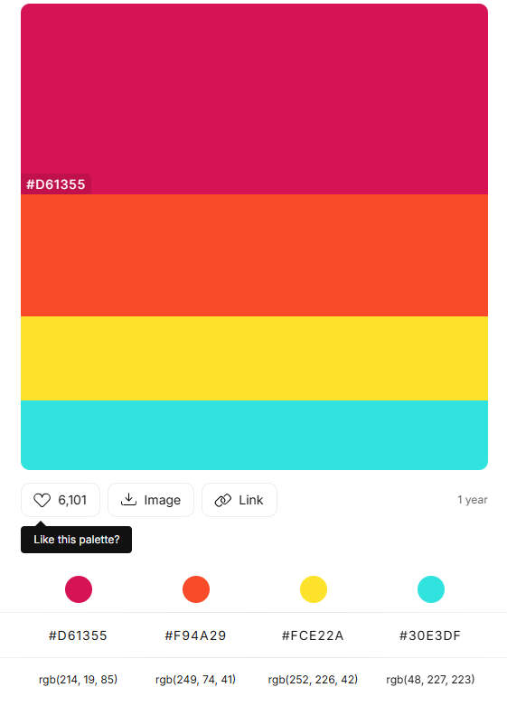

# WhimsyHue CSS Framework

## Overview
WhimsyHue is a lively and imaginative CSS framework designed to add a playful and colorful touch to your web projects. Built using Sass and Sass partials, WhimsyHue brings whimsical, vibrant hues to standard HTML elements, offering both creativity and functionality. This framework is perfect for designers who want their websites to exude a fun, lighthearted atmosphere while maintaining flexibility and ease of customization.

## Features
- **Custom Themes:** WhimsyHue features a bright, playful color palette that includes:
  - Magenta (#D61355)
  - Orange (#F94A29)
  - Yellow (#FCE22A)
  - Cyan (#30E3DF)
  
  These colors combine to create a joyful, engaging user experience.

- **Utility Classes:** WhimsyHue comes with a wide range of utility classes that simplify common styling tasks such as margin, padding, font sizing, and color applications. These classes ensure consistency across all elements while maintaining the framework’s playful aesthetic.
  
- **Customization:** The framework is highly customizable using Sass variables, allowing developers to modify the colors, spacing, and other properties to meet the needs of individual projects. 

- **Responsive Design:** Built to be fully responsive, WhimsyHue ensures that your designs look great on any device, offering a seamless experience across different screen sizes.

## Color Palette

## Installation
Clone the repository and link the compiled CSS file to your project. The Sass source files are provided for customization, making it easy to adapt the framework to your unique design needs.
