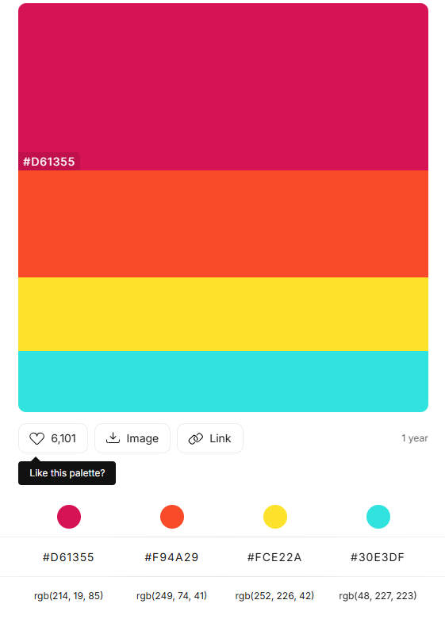

# WhimsyHue CSS Framework

## Overview

WhimsyHue is a lively and imaginative CSS framework designed to add a playful and colorful touch to your web projects. Built using Sass and Sass partials, WhimsyHue brings whimsical, vibrant hues to standard HTML elements, offering both creativity and functionality. This framework is perfect for designers who want their websites to exude a fun, lighthearted atmosphere while maintaining flexibility and ease of customization.

## Features

### Custom Themes
  WhimsyHue features a bright, playful color palette that includes:
  - Magenta (#D61355)
  - Orange (#F94A29)
  - Yellow (#FCE22A)
  - Cyan (#30E3DF)
  - Mint Green (#73EC8B)
  - Gray (#6c757d)
  - Black (#000000)
  - White (#FFFFFF)

  These colors combine to create a joyful, engaging user experience. Custom utility classes for background and text colors are included.
  
  

  **Example Color Classes:**
  - `.color-primary`
  - `.bg-secondary`
  - `.color-warning`
  - `.bg-info`
  - `.bg-success`

### Typography:
  Predefined styles for headings (`h1` to `h6`), paragraphs, and text formatting like `strong` and `em`. Customizable font sizes and weights are included for consistency across the project.

### Utility Classes
  WhimsyHue provides utility classes for common styling needs:
  - **Text Alignment:** `.text-left`, `.text-center`, `.text-right`
  - **Button Variants:** `.btn-primary`, `.btn-secondary`, `.btn-warning`, `.btn-info`, `.btn-success`, `.btn-dark`, `.btn-light`
  - **Spacing Utilities:** `.margin-md`, `.padding-lg`
  - **Width Utilities:** `.width-sm`, `.width-md`, `.width-lg`

### Forms:
  WhimsyHue includes custom-styled form inputs, checkboxes, radio buttons, and a submit button for intuitive form designs.

### Table Variants
WhimsyHue offers several table variants to enhance user interfaces:

- **Basic Table:** A clean, responsive table layout.
- **Striped Table:** Adds alternating background colors for rows or columns.
- **Hoverable Table:** Highlights rows on hover.
- **Dark Mode Table:** Offers a dark-themed table for modern UI needs.
These tables are responsive and designed to work well on different screen sizes.

### Buttons
WhimsyHue provides multiple button styles:
- **Primary Button:** .btn-primary 
- **Secondary Button:** .btn-secondary
- **Warning Button:** .btn-warning
- **Info Button:** .btn-info
- **Success Button:** .btn-success
- **Dark Button:** .btn-dark

### Responsive Design:
  WhimsyHue is built with responsiveness in mind. It offers media queries and utility classes to ensure your designs adapt seamlessly to different screen sizes.
  
## Installation
**1. Clone the Repository:** git clone https://github.com/mohs0025/Custom-CSS-Framework 
**2. Link the CSS:** Link the compiled CSS file whimsyhue.css into your HTML like this:
<link rel="stylesheet" href="css/whimsyhue.css">

